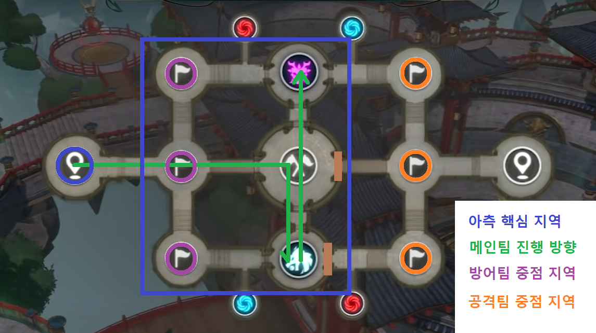

## [디스코드주소](https://discord.com/invite/yufuZH9NKE)

## [길드소개 및 방향성]

- __러쉬__ 킹덤은 남녀노소 함께 어우러지는 성인길드입니다.
- 친목 커뮤니티 길드활동 지향으로 킹덤을 운영 할 예정이나 킹덤 참여율 순위는 1위를 목표로 단합심이 높은 킹덤입니다.
- 꾸준히 열심히 하는 인원들로만 모집하여 끈끈한 커뮤니티를 바탕으로 커뮤니티를 극대화 해서 단합되고 즐거운 길드가 될 수 있도록 운영할 예정입니다.

- 길마 __려늬__ / 부길마 __달아이__ / 정예멤버  한뚝배기하실래예, 스퍼

## [가입조건]

- 카카오톡(공지방 / 단체방) 오픈채팅 __필수__ 참여
- 부계정 / 이중 길드 / 여왕벌 / 철새 / 물소는 받지 않습니다.
- 길드컨텐츠는 100%의 참여률에 도전해 주셔야 합니다.
- 될 수 있으면 디스코드 음성채팅 가능하신분(친목 디스코드는 필수가 아니나 길드 PVP컨텐츠시 듣기 __필수__)
- 가입제한투력 :  __60만__

## [킹덤규칙]

- 킹덤영지 출첵 필수 (2일이상 미접시 제명)
- 기부 3종 풀기부 필수
- 길드 컨텐츠 참여 필수
- 길드 PVP컨텐츠 일시 디스코드 듣기 필수 (개인사정으로 참여가 불가 할 시 간부진에게 미리 말씀해주세요.)
- 가장 기본적인 예의와 길드에 속해있다는 책임감을 항상 갖고 있을 것.
- 비속어 / 성희롱 / 시비 / 패드립 등 길드 내 외로 분란을 일으키는 행동은 강경하게 대응 할 예정입니다.
- 매일 23:30 월보, 00:00 필보 시간 디스코드 참여권장
- 킹덤 규칙에 부합되지않는 멤버는 킹덤 간부진 회의를 통해 제명 될 수 있습니다.

## 길드컨텐츠 진행시간

- 매주 수요일 : 킹덤 침공전 후 킹덤 던전 진행
- 매주 토요일 : 유물전장 후 킹덤 디펜스 진행

### [ 유물전장 / 킹덤 침공전 ]
- 20:50~21:00 길드영지에 모여 파티장님 초대로 파티 구성 진행
- 21:00~21:10 미완료 파티 확인 후 접속멤버님 초대하여 파티구성 완료
- 21:10~21:20 금주 전략 브리핑 및 버프 도핑 입장준비

### [킹덤 던전 / 킹덤 디펜스] 
- 21:50 유물 및 침공전이 끝나고 길드영지로
- 22:00 컨텐츠 시작

## [PK 규칙]
- 겹사하는 행위와 카오틱유저(닉이붉은유저) 포함 이유없는 선 PK는 금지
- 서버 내 무차별 pk하는 유저는 pk가능

### 일반필드
- 중립 이하설정
- 1채널 제외 채널에서 겹사하는 행위가 들어올 시 증거와 명분이 있는 사적재재 허용 (앞뒤 정황을 알수있는 사진과 동영상)
- 우리가 퀘로 인해 겹사가 진행될시 상대에서 자제요청 들어오면 바로 자리 이탈

### 카오스필드
- 정의 설정
- 증거와 명분이 있는 사적재재 허용 (앞뒤 정황을 알수있는 사진과 동영상)

### 지역쳇, 월쳇에 활용 논의
- 겹사올시 지역쳇과 귓속말만 이용 
- 겹사관련하여 월창 이용 금지
- 지역쳇, 월쳇에 시비조 대화 금지

## [행운상점 입찰]
- 행운상점 길드포인트 200개 이상 물품 입찰 금지 (200 미만 물품 자유)
- 공지방 사다리타기 진행 후 당첨자만 입찰
- 당첨자는 다른 킹덤원에게 입찰 양도 허용

## [유물전장]

### 전체진행
1. 6개점령지(아측3개, 중앙3개)를 점령하고 유지
2. 중앙점령지를 사수하며 버프타워, 중립몬스터를 공략
3. 메인팀 - 중앙, 방어팀 - 아측, 공격팀 - 적측 중점으로 진행

### 개인행동 - 사망후 재합류까지의 공백으로인한 전력누수 최소화
1. 생존을 목표로 적에게 돌격 금지
2. 아군과 라인을 유지하며 적을 공격
3. 사망시 메인팀에 빠르게 합류하는것을 목표로 행동
4. 부활후 합류 동선상 적 발견시, 다른 부활인원과 합류하여 공략후 메인에 합류(인원수 우위)

### 메인팀진행
1. 중앙 점령후 후냐, 바리게이트 설치 엄호
2. 버프 타워로 이동후 바리게이트 설치 엄호
3. 중립몬스터 지역으로 이동후 라인 형성
4. 중앙 점령지를 사수하며, 버프타워 각인, 중립몬스터 사냥을 공략

### 지원팀, 메인가팀
1. 중앙점령지에 후냐, 바리게이트 설치
2. 버프타워에 바리게이트 설치
3. 이후 메인팀과 동일하게 진행

### 공격팀진행 - 메인팀 1~3진행까지 동일
1. 적측 점령지를 공략하여 적메인에 인원분산을 유도
2. 적측 입구를 공략하여 합류를 저지

### 방어팀진행 - 메인팀 1~2진행까지 동일
1. 시계방향으로 아측 3개점령지 확보후 메인에 합류
2. 아측지역의 적 점령 견재, 방어
