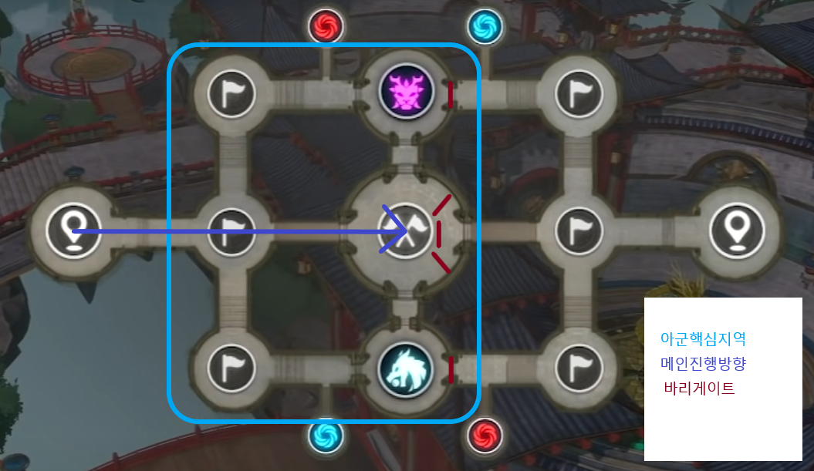

## [ **확인해주세요** ] **

 ### [파티 편성](https://docs.google.com/spreadsheets/d/1ZmqVB0v5BhWB3MoBMEtAPjRERrNWiBQsOntKVwJMpHY/edit?usp=sharing) 
 ### PK설정 : 정의 이하
 ### 킹덤 기부 : 3종 풀 기부


## [ **참여해주세요** ] **

### [디스코드](https://discord.gg/yufuZH9NKE)

### [카카오톡 - 공지방](https://open.kakao.com/o/gydbRCid)

### [카카오톡 - 대화방](https://open.kakao.com/o/gfkMyued)

### [카카오톡 - 의견방](https://open.kakao.com/o/g9tzFOid)

```sh
공지방 참여코드 : 43210
대화방 참여코드 : 43210
의견방 참여코드 : 59590
```
* * *

## [ **킹덤소개** ]


> 킹덤마스터 :  __려늬__
> 
> 킹덤부마스터 :  __달아이__


```sh
 러쉬 킹덤은 남녀노소 함께 어우러지는 성인킹덤입니다.
 
 친목 커뮤니티 킹덤활동 지향으로 킹덤을 운영 할 예정이나 킹덤 참여율 순위는 1위를 목표로 단합심이 높은 킹덤입니다.

 오래도록 같이 플레이할 인원을 모집하여 끈끈함 바탕으로 단합되고 즐거운 킹덤이 될 수 있도록 운영하겠습니다. 
```


## [ **가입조건** ]

- 투력 제한 :  __70만__
- 가입 제한 :  부계정 / 이중 킹덤 
- 필수 조건 :  카카오톡(공지방 / 대화방), 디스코드(듣기) 참여 


## [ **킹덤규칙** ]

- 킹덤 출석 : 필수 - 사유없는 2일이상 미접은 제명

- 킹덤 기부 : 필수 - 3가지 재화 풀기부

- 침공전, 유물전장  디스코드(듣기) 필수 

  _개인사정인한 컨텐츠 미참여 : 운영진에게 사전통보_

- 월보, 필보, 던전 등의 컨텐츠시 킹덤파티 참여 지향(디스코드 활용)

- 킹덤 내 외로 분란을 일으키는 행동( 막피 / 비매너 채팅) : 제명

  _킹덤 규칙을 위반하는 멤버는 운영진 결정에 의해 제명_


## [ **PK 규칙** ]
- PK 설정 : __정의__이하
- PK 가능 : 운영진이 공지한 킹덤, 지정인원(막피 등)
- 겹사관련 : 귓속말 / 지역채팅으로 대화가 가능하지않은 유저 - 증거 확보 후 PK 가능
  _중거 : 앞뒤 정황을 알수있는 사진이나 동영상 등_


## [ **행운상점 입찰규칙** ]
- 행운상점 길드포인트 200개 이상 물품 입찰 금지 (200 미만 물품 자유)
- 공지방 사다리타기 진행 후 당첨자만 입찰
- 당첨자는 다른 킹덤원에게 입찰 양도 허용

* * *


## [ **컨텐츠 진행시간** ]

|     구분     |  수요일    |   토요일   |
|:------------:|:---------:|:---------:|
|21:00 ~ 22:00 | 킹덤침공전 | 유물전장   |
|22:00 ~ 23:00 | 킹덤던전   | 킹덤디펜스 |


### 킹덤 침공전 - 수요일
- 21:00 ~ 21:20 영지 집합 / 파티 구성
- 21:20         침공전 입장 가능
- 21:30 ~ 21:45 침공전 전투

### 킹덤 던전 - 수요일
- 22:00 킹덤던전 시작


### 유물전장 - 토요일
- 21:00 ~ 21:20 영지 집합 / 파티 구성
- 21:20 ~ 22:00 유물전장 입장 가능
- 21:30 ~ 22:00 유물전장 전투


### 킹덤 디펜스 - 토요일
- 22:00 킹덤디펜스 시작


## [ **컨텐츠 - 유물전장** ]


### 전체진행
1. 6개점령지(아측3개, 중앙3개)를 점령하고 유지
2. 메인 - 중앙사수 /  방어 - 아측 점령 /  공격 - 버프공략
3. 중앙점령지를 사수하며 버프타워, 중립몬스터를 공략
4. 2개 버프 획득시 적 입구 봉쇄

### 개인행동 
- 사망후 재합류까지의 공백으로인한 전력누수 최소화
1. 아군과 라인을 유지하며 적을 공격
2. 부활후 아군핵심지역의 적점령지 공략 후 메인에 합류

### 메인
1. 중앙 점령
2. 바리게이트를 이용해서 라인형성
3. 2개 버프 획득시 적 입구 봉쇄

### 지원
1. 중앙점령지에 바리게이트 3개 설치
2. 버프타워 / 중립몬스터 지역에 바리게이트1개로 입구봉쇄
3. 이후 메인과 동일

### 공격
1. 중앙 점령
2. 지원의 바리게이트 설치 엄호
3. 버프타워, 중립몬스터 공략
4. 이후 메인과 동일

### 방어
1. 중앙점령
2. 부활인원과 함께 아군핵심지역에 적 점령지 점령
3. 버프타워, 중립몬스터 공략
4. 이후 메인과 동일


##  [ **컨텐츠 - 디펜스** ]

1. 중앙 몹 어글 : 어그러 뺑뺑이
2. 양 사이드 소환자 : 공격조 + 메인가
3. 중요 웨이브 
 - 2wave : 7시 소환자
 - 3wave : 중앙 날구리
 - 6wave : 5시 소환자
 - 8wave : 5시 7시 소환자 + 심장파괴자
* * *
## 팁
## [디펜스 3단계 깨는방법](https://www.youtube.com/watch?v=MxtLjaap2T8)
## [마지르 합성 냄비 공식](https://forum.netmarble.com/enn_ko/view/27/89333)
## [퍼즐 계산기](https://myar.tistory.com/entry/ninokuni-tetro-puzzle-calculator)
## [포즈북파밍 - 모든맵 보물상자 위치](https://forum.netmarble.com/enn_ko/view/27/84927)

* * *
